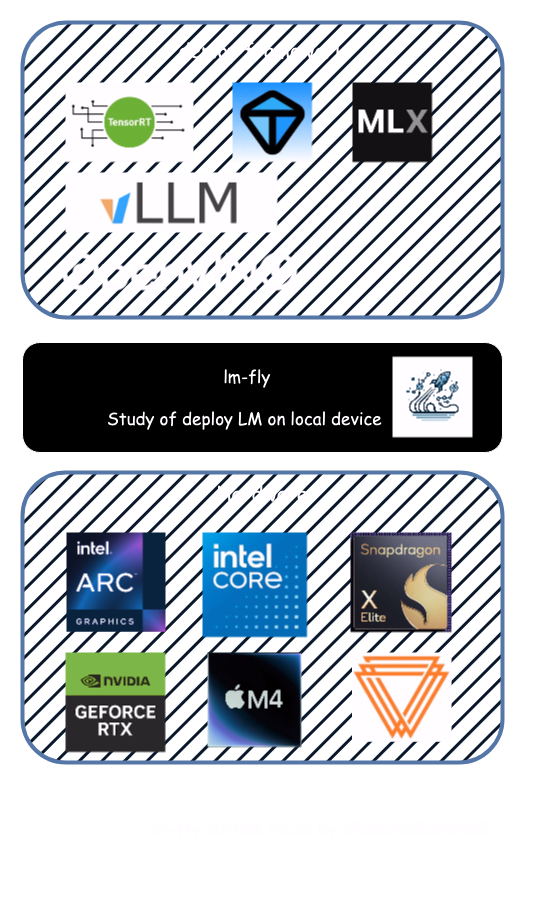

# lm-fly

 

    👋 大模型本地部署加速之路，让大模型推理 “飞” 起来</a>

## 项目介绍

欢迎来到本仓库，这里将会陆续提供加速框架的最简单实操。

本仓库将会提供几种主流LLM加速框架的快速实战和体验，通常包括：

1. UI界面：提供简单的web界面，方便用户进行加速任务的提交和管理。
2. openai接口：提供openai接口，方便用户通过代码进行加速任务的提交和管理。
3. 压力测试：提供压力测试脚本，方便用户进行加速任务的压力测试。

## 支持 / 学习的加速框架和硬件

下表展现了我现在对本仓库中回考虑的支持库框架的学习和适配顺序，项目才刚刚开始，如果您对本项目有兴趣，欢迎贡献PR或联系我！

+ ✓ ： 已经提供代码或者教程
+ ✗ ： 未提供代码或教程（还在书写或者学习中）
+ / ： 框架不支持

| LLM加速框架      | 是否支持 | gradio | openai接口 | 压力测试 | 微调 | 厂家          |
|--------------|------|--------|----------|------|----|-------------|
| TensorrT-LLM | ✓    | ✓      | ✓        | ✓    | /  | NVIDIA      |
| OpenVINO     | ✓    | ✓      | ✗        | ✗    | /  | Intel       |
| VLLM         | ✗    | ✗      | ✗        | ✗    | /  | lmsys       |
| MLX          | ✗    | ✗      | ✗        | ✗    | ✓  | Apple       |
| TGI          | ✗    | ✗      | ✗        | ✗    | ✗  | HuggingFace |

